<div align="center">

# 📈 股票分析与交易工具集 / Stock Analysis & Trading Tools


**🚀 一个功能完整的股票数据分析、可视化和程序化交易工具集**  
**🚀 A comprehensive stock data analysis, visualization and algorithmic trading toolkit**

*支持多种数据源和券商接口，从数据分析到实盘交易的一站式解决方案*  
*Supporting multiple data sources and broker interfaces, a one-stop solution from data analysis to live trading*

**语言选择 / Language Selection:**  
[🇨🇳 中文版本](#中文版本) • [🇺🇸 English Version](#english-version)

---

[快速开始](#-快速开始) • [功能特色](#-项目特色) • [使用指南](#-使用指南) • [API文档](#-高级功能) • [贡献指南](#-贡献指南)

</div>

---

## 中文版本

---

## 🌟 项目特色

<table>
<tr>
<td width="50%">

### 📊 数据分析功能
- 🔄 **多数据源支持** - 集成AKShare、Tushare等免费数据源
- 📈 **实时可视化** - 美观的股票数据图表展示
- 🔍 **技术指标** - MA、MACD、RSI、布林带等
- 💾 **数据导出** - 支持Excel、CSV格式导出
- ⚡ **高性能** - 数据缓存和异步处理

</td>
<td width="50%">

### 💼 交易功能
- 🏦 **多券商支持** - 华泰、佣金宝、银河、雪球等
- 🤖 **程序化交易** - 自动下单和风险控制
- 📋 **策略框架** - 基于easyquant的量化策略
- 🎯 **模拟交易** - 雪球模拟盘练习
- 🛡️ **风险管理** - 止损止盈和仓位控制

</td>
</tr>
<tr>
<td width="50%">

### 🛠️ 工具特性
- 🎨 **图形化界面** - 简单易用的GUI设计
- ⚙️ **配置助手** - 一键配置券商信息
- 🚀 **一键部署** - 完整的安装和启动脚本
- 📚 **详细文档** - 从入门到高级的完整指南

</td>
<td width="50%">

### 🔧 开发特性
- 🐍 **Python生态** - 基于成熟的Python金融库
- 🔌 **模块化设计** - 易于扩展和定制
- 🔒 **安全可靠** - 密码加密和安全连接
- 📱 **跨平台** - 支持Windows主流版本

</td>
</tr>
</table>

## 📁 项目结构

<details>
<summary>🗂️ 点击展开完整项目结构</summary>

```
📦 stock-analysis-tools/
├── 🎯 核心工具/
│   ├── 📊 beautiful_stock_visualizer.py    # 美化版股票可视化工具
│   ├── 🆓 free_stock_visualizer.py         # 免费股票数据工具  
│   ├── 💼 trading_stock_visualizer.py      # 交易版股票工具
│   ├── ⏰ realtime_stock_visualizer.py     # 实时股票监控工具
│   └── ⚙️ config_helper.py                 # 券商配置助手
├── 🕷️ 爬虫工具/
│   ├── 🔰 simple_crawler.py                # 基础爬虫
│   ├── 🚀 advanced_crawler.py              # 高级爬虫
│   ├── 💰 finance_crawler.py               # 金融数据爬虫
│   └── 📈 tushare_crawler.py               # Tushare数据爬虫
├── 🧠 量化策略/
│   └── 📋 strategy_example.py              # 策略示例模板
├── 📝 配置文件/
│   ├── 📂 config_examples/                 # 配置文件示例
│   │   ├── 🏦 ht.json                     # 华泰证券配置
│   │   ├── 💳 yjb.json                    # 佣金宝配置
│   │   ├── 🌌 yh.json                     # 银河证券配置
│   │   └── ❄️ xq.json                     # 雪球模拟配置
│   └── 🔒 my_configs/                      # 用户配置目录
├── 🚀 启动脚本/
│   ├── 🎨 启动美化版股票工具.bat
│   ├── 🆓 启动免费股票工具.bat
│   ├── 💼 启动交易工具.bat
│   └── ⚙️ 启动配置助手.bat
├── 📦 安装脚本/
│   ├── 🔧 安装依赖.bat
│   ├── 🆓 安装免费股票依赖.bat
│   └── 💼 install_trading_deps.bat
├── 📚 文档/
│   ├── 📊 股票可视化工具使用说明.md
│   ├── 💼 交易工具使用说明.md
│   ├── 🏦 券商配置获取指南.md
│   └── ⚙️ 配置获取详细教程.md
├── 🌐 GitHub相关/
│   ├── 📋 .gitignore
│   ├── 📄 LICENSE
│   ├── 📖 README.md
│   └── 🚀 上传到GitHub.bat
└── 📋 requirements.txt                     # 依赖包列表
```

</details>

## 🚀 快速开始

### 环境要求

- Python 3.7+
- Windows 10/11（推荐）
- 网络连接

### 安装步骤

1. **克隆项目**
   ```bash
   git clone https://github.com/nanyun818/stock-analysis-tools.git
   cd stock-analysis-tools
   ```

2. **安装基础依赖**
   ```bash
   # 双击运行
   安装依赖.bat
   
   # 或命令行安装
   pip install -r requirements.txt
   ```

3. **选择工具启动**
   - 免费版：双击 `启动免费股票工具.bat`
   - 美化版：双击 `启动美化版股票工具.bat`
   - 交易版：双击 `启动交易工具.bat`
   - 配置助手：双击 `启动配置助手.bat`

## 🛠️ 功能模块

### 📊 股票数据分析工具

<div align="center">

| 工具版本 | 特色功能 | 适用场景 | 推荐指数 |
|---------|---------|---------|----------|
| 🆓 **免费版** | 基础分析、无需配置 | 新手入门、快速查看 | ⭐⭐⭐⭐ |
| 🎨 **美化版** | 现代UI、多图表类型 | 日常分析、专业展示 | ⭐⭐⭐⭐⭐ |
| 💼 **交易版** | 实盘交易、策略回测 | 程序化交易、量化投资 | ⭐⭐⭐⭐⭐ |
| ⏰ **实时版** | 实时监控、预警提醒 | 盯盘交易、风险控制 | ⭐⭐⭐⭐ |

</div>

#### 🆓 免费版功能详解
```
✅ 基于AKShare免费数据源     📈 支持A股全市场数据
✅ 基础K线图和技术指标       📊 MA、MACD、RSI等常用指标  
✅ 股票搜索和数据导出       💾 Excel、CSV格式导出
✅ 简单易用，无需配置       🚀 双击即可运行
```

#### 🎨 美化版功能详解
```
✅ 现代化UI设计            🎨 Material Design风格
✅ 多种图表类型            📊 K线、分时、成交量等
✅ 技术指标分析            📈 20+种技术指标支持
✅ 数据缓存优化            ⚡ 提升查询速度50%+
```

#### 💼 交易版功能详解
```
✅ 集成数据分析和实盘交易   🔄 分析下单一体化
✅ 支持多券商接口          🏦 华泰、佣金宝、银河等
✅ 量化策略框架            🧠 基于easyquant开发
✅ 风险管理功能            🛡️ 止损止盈、仓位控制
```

### 💼 程序化交易功能

#### 🏦 支持券商列表

<table>
<tr>
<td width="25%" align="center">

**🏛️ 华泰证券**
- 🔐 加密交易密码
- 📱 支持手机验证
- ⚡ 快速下单
- 💰 低佣金费率

</td>
<td width="25%" align="center">

**💳 佣金宝**
- 🔐 加密登录密码
- 🌐 网页端交易
- 📊 实时行情
- 💸 超低佣金

</td>
<td width="25%" align="center">

**🌌 银河证券**
- 🔍 验证码识别
- 🖥️ 客户端交易
- 📈 专业工具
- 🏆 老牌券商

</td>
<td width="25%" align="center">

**❄️ 雪球模拟**
- 🎮 模拟交易
- 👨‍🎓 新手友好
- 📚 学习平台
- 🆓 完全免费

</td>
</tr>
</table>

#### 🚀 核心交易功能

<div align="center">

| 功能模块 | 功能描述 | 支持程度 |
|---------|---------|----------|
| 📡 **实时行情** | 获取最新股价、成交量等数据 | ✅ 全面支持 |
| 🤖 **自动下单** | 程序化买卖、批量操作 | ✅ 全面支持 |
| 📋 **持仓管理** | 查询持仓、盈亏分析 | ✅ 全面支持 |
| 💰 **资金查询** | 可用资金、流水记录 | ✅ 全面支持 |
| 🛡️ **风险控制** | 止损止盈、仓位限制 | ✅ 全面支持 |
| 📊 **策略回测** | 历史数据验证策略 | ✅ 全面支持 |

</div>

### 🧠 量化策略开发

<div align="center">

**基于 easyquant 框架的专业量化交易平台**

</div>

#### 🎯 策略开发流程

```mermaid
graph LR
    A[📝 策略设计] --> B[💻 代码实现]
    B --> C[📊 历史回测]
    C --> D[🎮 模拟交易]
    D --> E[💼 实盘运行]
    E --> F[📈 绩效分析]
    F --> A
```



#### 🛠️ 核心功能模块

<table>
<tr>
<td width="33%">

**📋 策略模板**
- 🎯 移动平均策略
- 📊 技术指标策略
- 🔄 网格交易策略
- 📈 趋势跟踪策略
- 🎲 自定义策略

</td>
<td width="33%">

**📊 回测系统**
- 📅 历史数据回测
- 📈 收益率分析
- 📉 最大回撤计算
- 📊 夏普比率评估
- 📋 详细交易记录

</td>
<td width="33%">

**🛡️ 风险管理**
- 💰 仓位控制
- 🛑 止损止盈
- ⏰ 时间止损
- 📊 风险度量
- 🚨 预警系统

</td>
</tr>
</table>

#### 💡 策略示例

```python
# 简单移动平均策略示例
class MAStrategy(StrategyTemplate):
    def __init__(self):
        self.short_window = 5   # 短期均线
        self.long_window = 20   # 长期均线
    
    def strategy(self, event):
        # 获取价格数据
        price_data = self.get_price_data()
        
        # 计算移动平均
        short_ma = price_data.rolling(self.short_window).mean()
        long_ma = price_data.rolling(self.long_window).mean()
        
        # 交易信号
        if short_ma[-1] > long_ma[-1]:  # 金叉买入
            self.buy()
        elif short_ma[-1] < long_ma[-1]:  # 死叉卖出
            self.sell()
```

### ⚙️ 配置管理工具

#### 🎨 图形化配置助手功能展示

<div align="center">

**一键配置，轻松上手 - 专为新手设计的配置助手**

</div>

<table>
<tr>
<td width="50%">

**🎯 核心功能**
- 📑 分券商配置页面
- 🔐 密码加密工具  
- 🔗 连接测试功能
- 📊 系统状态检查
- 💾 配置文件管理
- 📋 操作日志记录

</td>
<td width="50%">

**✨ 特色亮点**
- 🎨 现代化界面设计
- 🛡️ 安全密码处理
- ⚡ 实时连接验证
- 📱 响应式布局
- 🔄 自动备份恢复
- 💡 智能错误提示

</td>
</tr>
</table>

#### 🚀 使用流程

```
1️⃣ 启动配置助手 → 2️⃣ 选择券商类型 → 3️⃣ 填写账户信息 → 4️⃣ 测试连接 → 5️⃣ 保存配置
```

#### 📋 支持的配置项

| 券商类型 | 必填信息 | 可选信息 | 安全等级 |
|---------|---------|---------|----------|
| 🏛️ 华泰证券 | 账号、加密密码 | 验证码设置 | 🔒🔒🔒 |
| 💳 佣金宝 | 手机号、加密密码 | 自动登录 | 🔒🔒🔒 |
| 🌌 银河证券 | 账号、密码 | 验证码识别 | 🔒🔒 |
| ❄️ 雪球模拟 | 用户名、密码 | 组合代码 | 🔒 |

## 📖 使用指南

### 🎯 新手推荐学习路径

<div align="center">

**从零基础到量化高手的完整学习路径**

</div>

#### 🚀 四步进阶法

<table>
<tr>
<td width="25%" align="center">

**🆓 第一步：免费体验**


📋 **任务清单**
- ✅ 运行免费股票工具
- ✅ 查询股票基本信息
- ✅ 查看K线图表
- ✅ 导出数据到Excel

🎯 **学习目标**
- 熟悉界面操作
- 理解基础概念
- 掌握数据查询

</td>
<td width="25%" align="center">

**🎨 第二步：美化体验**


📋 **任务清单**
- ✅ 运行美化版工具
- ✅ 学习技术指标
- ✅ 分析股票走势
- ✅ 制作分析报告

🎯 **学习目标**
- 掌握技术分析
- 理解市场规律
- 培养分析思维

</td>
<td width="25%" align="center">

**🎮 第三步：模拟交易**


📋 **任务清单**
- ✅ 配置雪球模拟盘
- ✅ 制定交易策略
- ✅ 执行模拟交易
- ✅ 分析交易结果

🎯 **学习目标**
- 实践交易流程
- 验证交易策略
- 积累交易经验

</td>
<td width="25%" align="center">

**💼 第四步：实盘交易**


📋 **任务清单**
- ✅ 配置真实券商
- ✅ 小资金测试
- ✅ 风险控制设置
- ✅ 逐步增加投入

🎯 **学习目标**
- 真实市场体验
- 心理素质锻炼
- 持续盈利能力

</td>
</tr>
</table>

#### 📚 详细操作指南

<details>
<summary>🆓 <strong>第一步详细操作</strong></summary>

1. **环境准备**
   ```bash
   # 双击运行安装脚本
   安装免费股票依赖.bat
   ```

2. **启动工具**
   ```bash
   # 双击启动免费版工具
   启动免费股票工具.bat
   ```

3. **基础操作**
   - 在搜索框输入股票代码（如：000001）
   - 选择时间周期（日K、周K、月K）
   - 查看技术指标（MA、MACD等）
   - 导出数据进行进一步分析

</details>

<details>
<summary>🎨 <strong>第二步详细操作</strong></summary>

1. **启动美化版**
   ```bash
   启动美化版股票工具.bat
   ```

2. **高级功能**
   - 多股票对比分析
   - 自定义技术指标参数
   - 图表样式个性化设置
   - 数据缓存和性能优化

3. **分析技巧**
   - 学习K线形态识别
   - 掌握技术指标组合使用
   - 理解支撑位和阻力位

</details>

<details>
<summary>🎮 <strong>第三步详细操作</strong></summary>

1. **配置模拟盘**
   ```bash
   # 启动配置助手
   启动配置助手.bat
   ```
   - 选择"雪球模拟"标签页
   - 输入雪球账号密码
   - 测试连接并保存配置

2. **开始模拟交易**
   ```bash
   # 启动交易工具
   启动交易工具.bat
   ```
   - 查看模拟资金和持仓
   - 执行买入卖出操作
   - 设置止损止盈

3. **策略验证**
   - 制定明确的交易规则
   - 严格按照策略执行
   - 记录每笔交易的原因和结果

</details>

<details>
<summary>💼 <strong>第四步详细操作</strong></summary>

1. **券商开户**
   - 选择合适的券商（华泰、佣金宝等）
   - 完成开户流程
   - 获取交易账号和密码

2. **配置真实账户**
   ```bash
   启动配置助手.bat
   ```
   - 选择对应券商标签页
   - 输入真实账户信息
   - 加密保存交易密码

3. **风险控制**
   - 设置合理的仓位比例
   - 制定严格的止损规则
   - 控制单笔交易金额
   - 定期评估交易绩效

</details>

### 券商配置指南

详细配置步骤请参考：
- [券商配置获取指南.md](券商配置获取指南.md)
- [配置获取详细教程.md](配置获取详细教程.md)

## 🔧 高级功能

### 自定义策略开发

```python
# 基于strategy_example.py修改
from easyquant import StrategyTemplate

class MyStrategy(StrategyTemplate):
    def strategy(self, event):
        # 实现你的交易逻辑
        pass
```

### 数据源扩展

支持添加新的数据源：
- 修改对应的可视化工具
- 添加数据获取接口
- 更新配置文件

### 券商接口扩展

基于easytrader框架，可以扩展支持更多券商。

## 📊 技术栈

- **数据获取**：AKShare, Tushare, easyquotation
- **数据处理**：Pandas, NumPy
- **可视化**：Matplotlib, Tkinter
- **交易接口**：easytrader, easyquant
- **网络请求**：Requests, urllib
- **数据解析**：BeautifulSoup, lxml

## ⚠️ 重要提醒

### 安全注意事项

1. **配置文件安全**
   - 配置文件包含敏感信息，请妥善保管
   - 不要将真实配置文件上传到公共仓库
   - 定期更改交易密码

2. **网络安全**
   - 使用安全的网络环境
   - 避免在公共WiFi下进行交易操作

3. **资金安全**
   - 建议先使用模拟盘测试
   - 设置合理的止损止盈
   - 不要投入超过承受能力的资金

### 投资风险提醒

- 股市有风险，投资需谨慎
- 程序化交易不保证盈利
- 请根据自身风险承受能力进行投资
- 建议咨询专业投资顾问

## 🤝 贡献指南

欢迎提交Issue和Pull Request！

1. Fork 本项目
2. 创建特性分支 (`git checkout -b feature/AmazingFeature`)
3. 提交更改 (`git commit -m 'Add some AmazingFeature'`)
4. 推送到分支 (`git push origin feature/AmazingFeature`)
5. 打开 Pull Request

## 📝 更新日志

### v1.0.0 (2024-01-XX)
- ✨ 初始版本发布
- ✨ 支持多种股票数据源
- ✨ 集成程序化交易功能
- ✨ 提供图形化配置工具
- ✨ 完整的文档和示例

## 📄 许可证

本项目采用 MIT 许可证 - 查看 [LICENSE](LICENSE) 文件了解详情

## 🙏 致谢

感谢以下开源项目：
- [AKShare](https://github.com/akfamily/akshare) - 免费股票数据
- [easytrader](https://github.com/shidenggui/easytrader) - 程序化交易
- [easyquant](https://github.com/shidenggui/easyquant) - 量化交易框架
- [Tushare](https://github.com/waditu/tushare) - 金融数据接口

## 📞 联系方式

- 🌐 项目主页：https://github.com/nanyun818/stock-analysis-tools
- 🐛 问题反馈：https://github.com/nanyun818/stock-analysis-tools/issues
- 💬 讨论交流：https://github.com/nanyun818/stock-analysis-tools/discussions
- 📧 邮件联系：nanyun818@example.com

---

**免责声明**：本工具仅供学习和研究使用，使用者需自行承担投资风险。开发者不对任何投资损失承担责任。

---

## English Version

<div align="center">

# 📈 Stock Analysis & Trading Tools

**🚀 A comprehensive stock data analysis, visualization and algorithmic trading toolkit**

*Supporting multiple data sources and broker interfaces, a one-stop solution from data analysis to live trading*

[Quick Start](#-quick-start-en) • [Key Features](#-key-features-en) • [Usage Guide](#-usage-guide-en) • [Advanced Features](#-advanced-features-en) • [Contributing](#-contributing-en)

</div>

## 🎯 Key Features {#-key-features-en}

| Category | Features | Description |
|----------|----------|-------------|
| **📊 Data Analysis** | Multi-source Data | Support AKShare, TuShare, and web scraping |
| | Real-time Visualization | Beautiful stock charts and technical indicators |
| | Technical Analysis | MA, MACD, RSI, Bollinger Bands, etc. |
| | Data Export | Excel and CSV format support |
| **💼 Trading** | Multi-broker Support | Huatai, YJB, Galaxy, Xueqiu, etc. |
| | Algorithmic Trading | Automated order execution and risk control |
| | Strategy Framework | Based on easyquant quantitative strategies |
| | Paper Trading | Xueqiu simulation for practice |
| **🛠️ Tools** | GUI Interface | User-friendly graphical interface |
| | Configuration Helper | One-click broker setup |
| | One-click Deployment | Complete installation scripts |
| | Comprehensive Documentation | From beginner to advanced guides |

## 🚀 Quick Start {#-quick-start-en}

### Requirements
- Python 3.7+
- Windows 10/11 (recommended)
- Internet connection

### Installation

1. **Clone the repository**
   ```bash
   git clone https://github.com/nanyun818/stock-analysis-tools.git
   cd stock-analysis-tools
   ```

2. **Install dependencies**
   ```bash
   # Double-click to run
   安装依赖.bat
   
   # Or install via command line
   pip install -r requirements.txt
   ```

3. **Launch tools**
   - Free version: Double-click `启动免费股票工具.bat`
   - Beautiful version: Double-click `启动美化版股票工具.bat`
   - Trading version: Double-click `启动交易工具.bat`
   - Configuration helper: Double-click `启动配置助手.bat`

## 📊 Tool Modules {#-tool-modules-en}

### Stock Analysis Tools

| Tool Version | Features | Use Case | Rating |
|-------------|----------|----------|--------|
| 🆓 **Free Version** | Basic analysis, no configuration needed | Beginners, quick viewing | ⭐⭐⭐⭐ |
| 🎨 **Beautiful Version** | Modern UI, multiple chart types | Daily analysis, professional presentation | ⭐⭐⭐⭐⭐ |
| 💼 **Trading Version** | Live trading, strategy backtesting | Algorithmic trading, quantitative investment | ⭐⭐⭐⭐⭐ |
| ⏰ **Real-time Version** | Real-time monitoring, alerts | Market watching, risk control | ⭐⭐⭐⭐ |

### Supported Brokers

| Broker | Features | Status |
|--------|----------|--------|
| **🏛️ Huatai Securities** | Encrypted password, mobile verification | ✅ Supported |
| **💳 YJB** | Web trading, real-time quotes | ✅ Supported |
| **🌌 Galaxy Securities** | Client trading, professional tools | ✅ Supported |
| **❄️ Xueqiu Simulation** | Paper trading, beginner-friendly | ✅ Supported |

## 📚 Usage Guide {#-usage-guide-en}

### Learning Path for Beginners

| Stage | Focus | Duration | Tools |
|-------|-------|----------|-------|
| **🆓 Step 1: Free Experience** | Basic concepts | 30 minutes | Free Stock Tool |
| **🎨 Step 2: Enhanced Analysis** | Technical analysis | 1 hour | Beautiful Stock Tool |
| **🎮 Step 3: Paper Trading** | Trading practice | 1 week | Simulation Trading |
| **💼 Step 4: Live Trading** | Real trading | Ongoing | Full Trading Platform |

## 🔧 Advanced Features {#-advanced-features-en}

### Custom Strategy Development
```python
# Based on strategy_example.py
from easyquant import StrategyTemplate

class MyStrategy(StrategyTemplate):
    def strategy(self, event):
        # Implement your trading logic
        pass
```

### Data Source Extension
- Support for adding new data sources
- Modify corresponding visualization tools
- Add data acquisition interfaces
- Update configuration files

### Broker Interface Extension
Based on the easytrader framework, support for more brokers can be extended.

## 📊 Technology Stack

- **Data Acquisition**: AKShare, Tushare, easyquotation
- **Data Processing**: Pandas, NumPy
- **Visualization**: Matplotlib, Tkinter
- **Trading Interface**: easytrader, easyquant
- **Network Requests**: Requests, urllib
- **Data Parsing**: BeautifulSoup, lxml

## ⚠️ Important Disclaimers

### Security Notes
1. **Configuration Security** - Keep configuration files secure, don't upload real configs to public repositories
2. **Network Security** - Use secure network environments, avoid public WiFi for trading
3. **Fund Security** - Test with simulation first, set reasonable stop-loss, don't invest more than you can afford

### Investment Risk Warning
- Stock market involves risks, invest cautiously
- Algorithmic trading does not guarantee profits
- Please invest according to your risk tolerance
- Consult professional investment advisors

## 🤝 Contributing {#-contributing-en}

Welcome to submit Issues and Pull Requests!

1. Fork this project
2. Create a feature branch (`git checkout -b feature/AmazingFeature`)
3. Commit your changes (`git commit -m 'Add some AmazingFeature'`)
4. Push to the branch (`git push origin feature/AmazingFeature`)
5. Open a Pull Request

## 📄 License

This project is licensed under the MIT License - see the [LICENSE](LICENSE) file for details.

## 🙏 Acknowledgments

Thanks to the following open source projects:
- [AKShare](https://github.com/akfamily/akshare) - Free stock data
- [easytrader](https://github.com/shidenggui/easytrader) - Algorithmic trading
- [easyquant](https://github.com/shidenggui/easyquant) - Quantitative trading framework
- [Tushare](https://github.com/waditu/tushare) - Financial data interface

## 📞 Contact

- 🌐 Project Homepage: https://github.com/nanyun818/stock-analysis-tools
- 🐛 Issue Reporting: https://github.com/nanyun818/stock-analysis-tools/issues
- 💬 Discussions: https://github.com/nanyun818/stock-analysis-tools/discussions
- 📧 Email: nanyun818@example.com

---

**Disclaimer**: This tool is for educational and research purposes only. Users are responsible for their own investment risks. Developers are not liable for any investment losses.